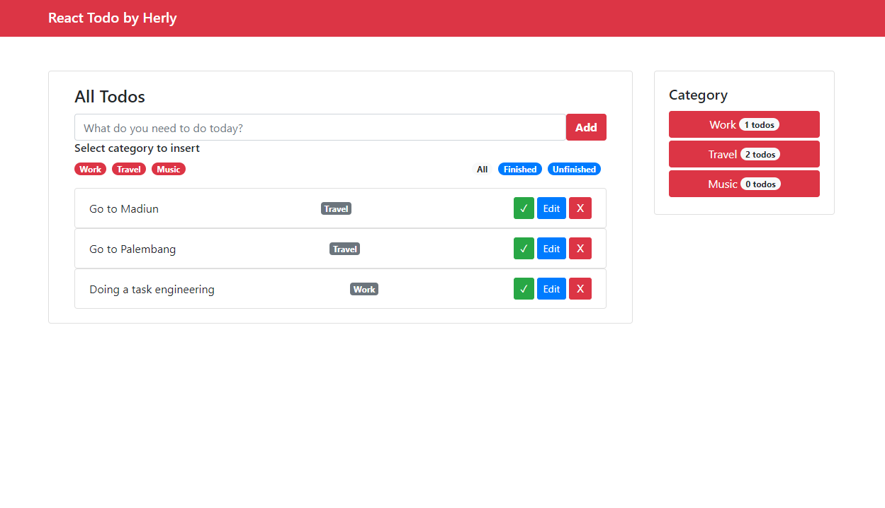
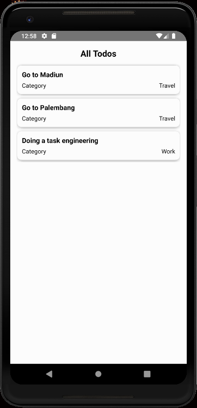

## Preview



## Installation Soal 1

- Clone the Repo
- Install all library needed to environment by using command

```bash
$ cd soal1
$ npm install
```

## Usage

- Start server with command:

```bash
$ cd soal1
$ npm start
```

Then open [http://localhost:3000/](http://localhost:3000/)

## Preview



## Installation Soal 2

- Clone the Repo
- Install all library needed to environment by using command

```bash
$ cd soal2
$ npm install
```

## Usage

- Start android with command:

```bash
$ cd soal2
$ npm run android
```
